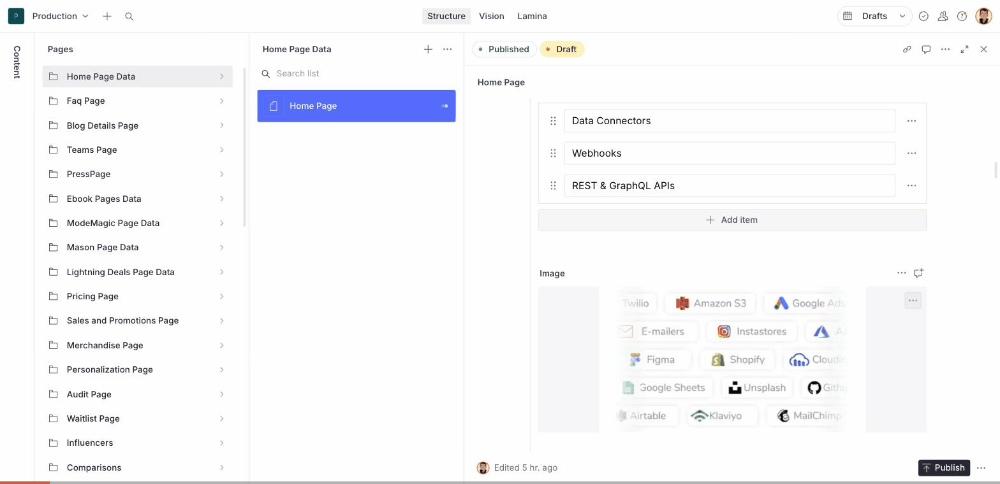

# Lamina Video & Image Creator for Sanity

Sanity Studio plugin that lets content editors generate and manage media assets with [Lamina](https://uselamina.ai) directly inside Sanity Studio.



## Features

- **Asset Source** -- "Generate with Lamina" appears in every image/file field dropdown. Type a brief, Lamina generates media, click "Use this" to save it as a Sanity asset.
- **Context-Aware** -- Auto-suggests briefs from document title, field name, and schema type. No prompt engineering needed.
- **Aspect Ratio Detection** -- Detects the target aspect ratio from field name (e.g. heroImage -> 16:9, ogImage -> 16:9) and passes it to the API.
- **Studio Tool** -- "Lamina" tab in top Studio nav with embedded Lamina editor and a filterable asset browser.
- **From Library** -- Reuse previously generated Lamina assets directly from the Generate dialog.
- **Output Presets** -- Configure per-field generation presets (aspect ratio, modality, platform) via plugin config.
- **Batch Generation** -- Generate 2-5 variants at once with the "Generate variants" toggle.
- **App Picker** -- Browse or AI-match Lamina apps before generating, with credit cost estimates.
- **Smart History** -- Recently used prompts appear as suggestion chips. App selections are remembered per field type.
- **Quality Feedback** -- Rate outputs after saving to improve future generation quality.
- **Brand & Campaign** -- Select brand profiles and campaigns when available to keep outputs on-brand.
- **OAuth Support** -- Optional per-user authentication alongside team-level API keys.

## Installation

```bash
npm install sanity-plugin-lamina
```

## Configuration

```ts
// sanity.config.ts
import { defineConfig } from 'sanity'
import { laminaPlugin } from 'sanity-plugin-lamina'

export default defineConfig({
  // ...your config
  plugins: [
    laminaPlugin({
      apiKey: process.env.SANITY_STUDIO_LAMINA_API_KEY!,
    }),
  ],
})
```

### Options

| Option | Type | Default | Description |
|---|---|---|---|
| `apiKey` | `string` | -- | Lamina API key (team-level). Required unless OAuth is configured. |
| `baseUrl` | `string` | `https://app.uselamina.ai` | Lamina API base URL. |
| `oauth` | `{ clientId, redirectUri?, storageKey? }` | -- | OAuth config for per-user authentication. |
| `enableTool` | `boolean` | `true` | Register the Lamina Editor as a Studio tool. |
| `enableDocumentAction` | `boolean` | `true` | Register the "Edit in Lamina" document action. |
| `webhookUrl` | `string` | -- | Webhook URL for generation completion events (alternative to polling). |

### OAuth Configuration

For per-user authentication instead of (or alongside) a team API key:

```ts
laminaPlugin({
  oauth: {
    clientId: 'your-lamina-oauth-client-id',
    redirectUri: 'https://your-studio.sanity.studio/lamina/callback', // optional
  },
})
```

Users without a team API key will see a "Sign in with Lamina" button.

## How It Works

### Asset Source (Generate Dialog)

1. Click "Generate with Lamina" in any image or file field
2. Describe what you need in the brief field
3. Optionally select a specific Lamina app or let auto-detect choose
4. Click Generate -- the plugin calls `content.create()` and polls for completion
5. Preview generated outputs and click "Use this" to save as a Sanity asset

Generated assets are tagged with `source.name: 'lamina'` and include the run ID and URL for traceability.

### Studio Tool

The Lamina tab in the top nav provides:

- **Editor tab** -- Embedded Lamina editor via iframe. Assets generated here are automatically saved to Sanity via postMessage bridge.
- **Assets tab** -- Browse all Lamina-generated assets in your Sanity dataset with thumbnails, filenames, and links to the original Lamina run. Filter by type (images/videos), search by filename, and scroll to load more.

### Document Action

The "Edit in Lamina" action uses schema-aware discovery to find all image/file fields in a document (at any nesting depth), checks if their assets have Lamina source metadata, and opens the original run for editing.

## Development

```bash
npm install
npm run build     # tsc -> dist/
npm run dev       # tsc --watch
```

### Local Testing

```bash
# In this repo:
npm run dev

# In a Sanity Studio project:
# Add to package.json: "sanity-plugin-lamina": "file:../sanity-lamina"
# Then add to sanity.config.ts as shown above
```

## Architecture

```
src/
  index.ts                          # Public exports
  plugin.tsx                        # definePlugin -- registers all surfaces
  types.ts                          # Plugin options, generation state types
  lib/
    LaminaContext.tsx                # React context + OAuth login flow
    oauth.ts                        # OAuth token management utilities
  components/
    LaminaAssetSource.tsx           # Asset source definition
    GenerateDialog.tsx              # Generation UI with app picker + multi-select
    LaminaFieldAction.tsx           # Field-level "Edit in Lamina" button
  tool/
    LaminaTool.tsx                  # Studio tool with editor + asset browser tabs
  actions/
    regenerateAction.tsx            # Schema-aware document action
```

## License

MIT -- see [LICENSE](./LICENSE).
